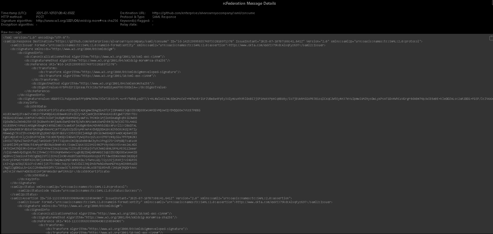
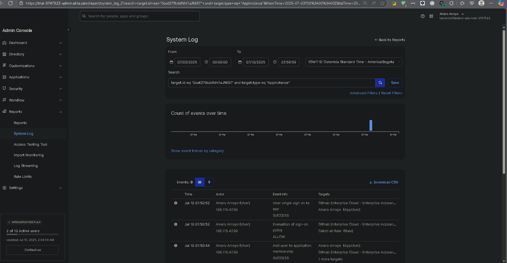
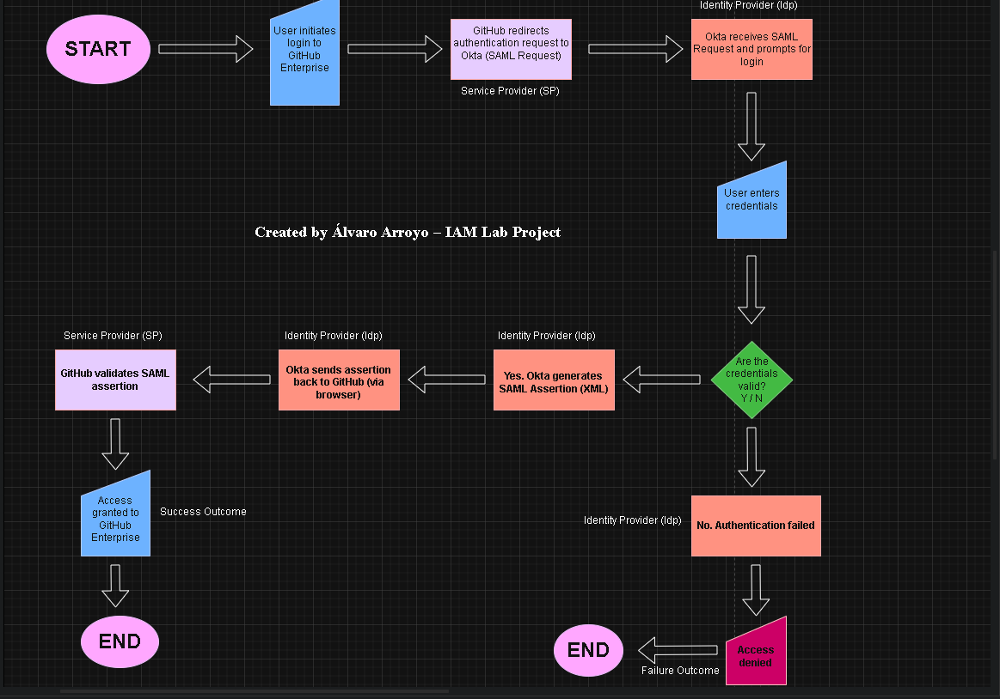

# 🔐 Okta + GitHub Enterprise SSO Integration

This project demonstrates a simulated SSO (Single Sign-On) integration between **Okta** and **GitHub Enterprise** using **SAML 2.0**. It includes screenshots, SAML assertion samples, and a complete configuration walkthrough.

---

## 🧠 Objectives

- Configure Okta as the Identity Provider (IdP)
- Configure GitHub Enterprise as the Service Provider (SP)
- Enable SSO via SAML
- Analyze SAML assertions
- Document the authentication flow

---

## 🧰 Technologies Used

- ✅ Okta Admin Console (Free Developer Account)
- ✅ GitHub Enterprise (simulated setup)
- ✅ SAML 2.0
- ✅ XML 
- ✅ Draw.io (for diagrams)
- ✅ SAML, WS-Federation and OAuth tracer extension for browser

---

## 📸 Screenshots

| Step | Description |
|------|-------------|
|  | Okta SAML App Configuration |
|  | GitHub Enterprise SSO Configuration |
|  | SAML Certificates and MFA Authentication |
|  | Sample SAML Assertion from Okta |
|  | Okta Logs |

---

## 📋 Step-by-Step Configuration

1. Create a new SAML 2.0 app in Okta.
2. Enter the GitHub ACS (Assertion Consumer Service) URL.
3. Download the metadata XML from Okta.
4. In GitHub Enterprise, go to Settings > Authentication and upload the metadata.
5. Assign test users to the Okta app.
6. Test SSO login and validate assertions.

---

## 🧪 SAML Assertion Sample

Check [`saml_assertion_example.xml`](okta_app_saml_assertion_example.xml) for a decoded assertion.

---

## 📈 Flow Diagram

---

## 📩 Contact

Built by Álvaro Arroyo — [LinkedIn](https://www.linkedin.com/in/alvaro-arroyo-vasquez-910227342/)
